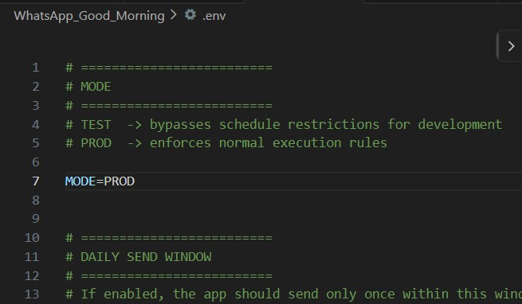
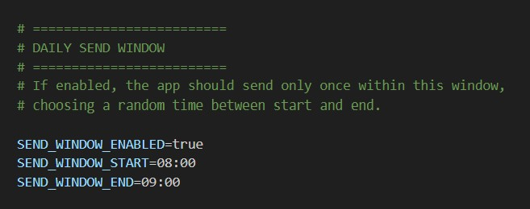
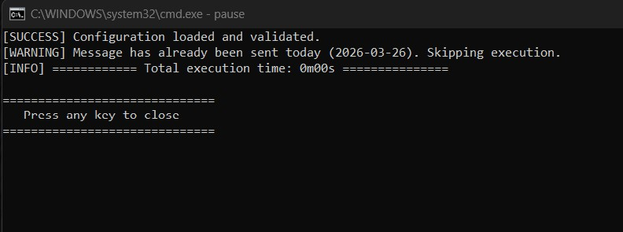
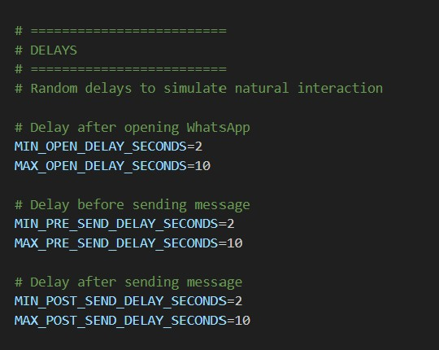
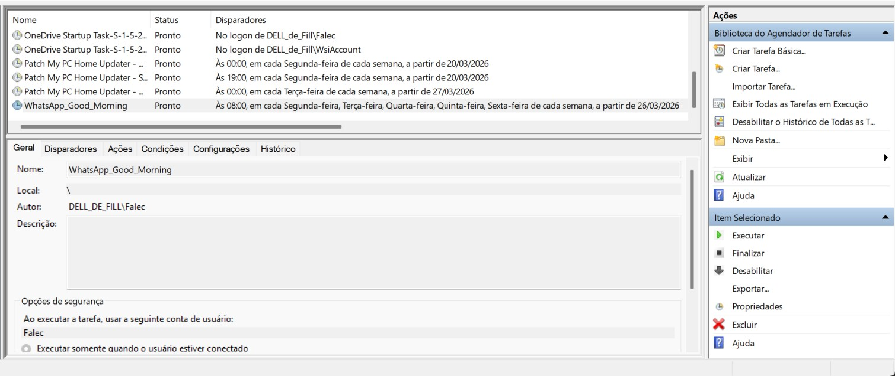
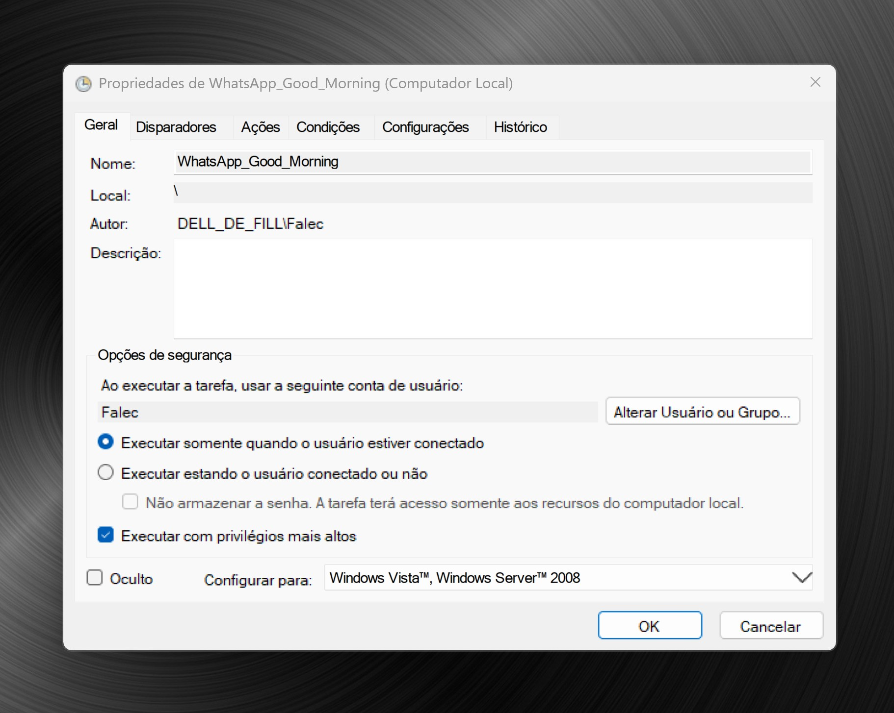
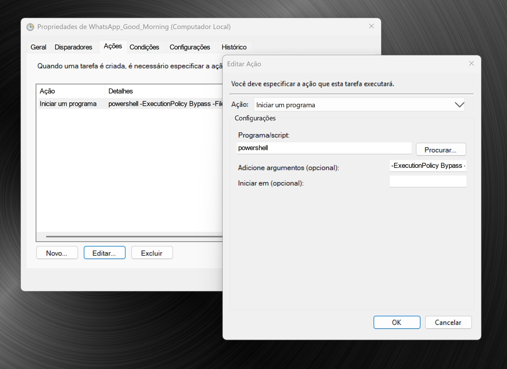
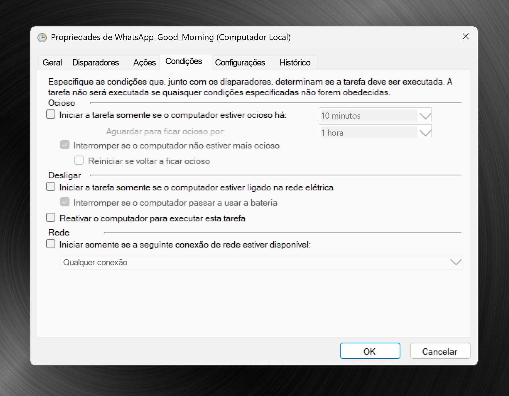
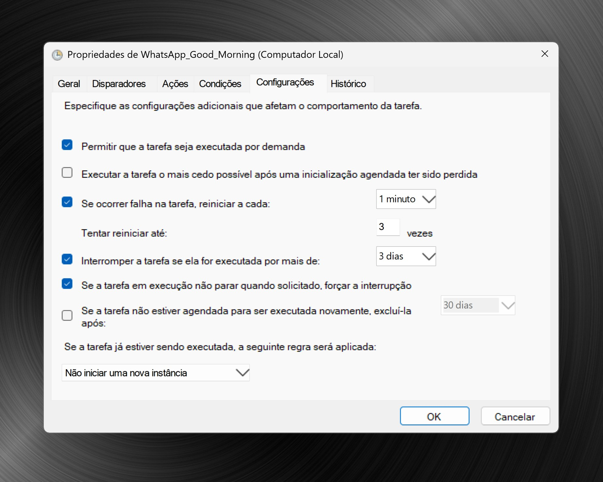

# WhatsApp_Good_Morning

> WhatsApp Automated Messaging System  
> Built with Selenium + WhatsApp Web

  
  
  
  

A local automation system that sends **one personalized WhatsApp message per day** using **WhatsApp Web + Selenium**.

Designed for **reliability**, **simplicity**, and **human-like behavior**. Runs locally via **Windows Task Scheduler**.

---

# 🎬 Demo (what happens in practice)


1. Task Scheduler triggers execution  
2. Script starts in PowerShell  
3. System checks if a message was already sent today  
4. Waits for a random time inside the configured window (`PROD` mode)  
5. Opens WhatsApp Web  
6. Sends the message  
7. Updates the daily send state  
8. Closes the browser  

---

# 🧠 Why This Project Matters

This is not just a script. This project showcases practical automation with a focus on reliability, realism, and safe execution.

It demonstrates **real engineering thinking**:

- deterministic execution  
- system reliability  
- user-behavior simulation  
- safe automation design  

---

# ✨ Features

- Automated WhatsApp message delivery via WhatsApp Web  
- Smart daily execution (**one message per day**)  
- Random send time within a configurable window  
- Human-like delays (open, pre-send, post-send)  
- Retry mechanism with error handling  
- Execution modes (`TEST` / `PROD`)  
- Modular architecture  
- Structured logging  
- Environment-based configuration (`.env`)  
- Message templates via `.txt` files  
- Headless mode with automatic fallback  
- Duplicate prevention via `last_sent.txt`  
- Failure artifacts (screenshot + HTML)  
- Portable PowerShell launcher for Windows  

---

# 📁 Project Structure

```text
WhatsApp_Good_Morning/
├── chrome_profile/
├── config/
│   ├── greetings.example.txt
│   ├── greetings_private.txt
│   ├── messages.example.txt
│   └── messages_private.txt
├── data/
│   └── last_sent.txt
├── docs/
├── logs/
│   ├── error.log
│   ├── execution.log
│   └── launcher.log
├── modules/
│   ├── config_loader.py
│   ├── logger.py
│   ├── message_generator.py
│   └── sender_web.py
├── .env
├── .env.example
├── .gitignore
├── main.py
├── requirements.txt
├── requirements-lock.txt
└── run_whatsapp_sender.ps1
```

## Dependencies

```
selenium  
python-dotenv
```

---

# 🏗️ Architecture

|Module|Responsibility|
|---|---|
|`main.py`|Orchestration, scheduling, retry logic, daily send control|
|`config_loader.py`|Environment loading and validation|
|`sender_web.py`|Selenium automation and WhatsApp Web interaction|
|`message_generator.py`|Random message generation|
|`logger.py`|Structured logging|

---

# ⚙️ How It Works

1. Script starts (via Task Scheduler or manual execution)
2. Loads configuration from `.env`
3. Checks whether a message was already sent today using `data/last_sent.txt`
4. If `MODE=PROD`, selects a random time inside the configured send window
5. Generates a random two-line message from `.txt` files
6. Opens WhatsApp Web via Selenium
7. Sends the message
8. Validates delivery using WhatsApp UI state
9. Stores today's date in `data/last_sent.txt`
10. Closes the browser

---

# 🎛️ Execution Modes

|Mode|Behavior|
|---|---|
|🟡 `TEST`|Ignores send window and runs immediately|
|🟢 `PROD`|Enforces send window and random scheduling|



---

# ⏱️ Smart Scheduling

Configured via `.env`:



## Behavior

- Script starts at the beginning of the configured window
- A random send time is selected
- Exactly one message is sent within the window

---

# 🛡️ Duplicate Protection

Uses:

**`data/last_sent.txt`**

- Stores the last successful send date
- Prevents multiple sends on the same day
- Ensures idempotent daily execution



---

# 🤖 Human-like Behavior

Delays are randomized for:

- opening the chat
- pre-send wait
- post-send wait

Configured via `.env`:



---

# 💬 Output Example

Example of a real message sent via WhatsApp:


- **Line 1** → Random greeting
- **Line 2** → Random message

Both lines are **randomly selected at runtime**, simulating natural human behavior and avoiding repetitive patterns.

---

# ✏️ Message Customization

Messages are fully customizable through simple `.txt` files:

|File|Purpose|
|---|---|
|`config/greetings_private.txt`|First line (greeting)|
|`config/messages_private.txt`|Second line (main message)|

## How it works

- Each line in a file represents one possible message option
- The system randomly selects **one line from each file**
- The final message is composed dynamically

## Example: Greetings

`config/greetings_private.txt`

Good morning!  
Hello!  
Hey there!  
Wishing you a great day!  
Rise and shine!

## Example: Messages

`config/messages_private.txt`

Hope your day is full of positive energy!  
Stay focused and make today count.  
Keep pushing forward — you're doing great!  
Wishing you a productive and successful day!  
Take a moment to enjoy the little things today.

> Note: some Unicode characters and advanced emojis may be sanitized automatically before typing, due to ChromeDriver limitations.

---

# 🛠️ Installation

## 1️⃣ Create virtual environment

```
python -m venv venv
```

## 2️⃣ Activate

**Git Bash:**

```bash
source venv/scripts/activate
```

**Windows / PowerShell:**

```powershell
.\venv\Scripts\Activate.ps1
```

## 3️⃣ Install dependencies

```
pip install -r requirements.txt
```

---

# 🔑 Initial Setup (Required)  
  
After installing the dependencies and creating the virtual environment, you need to prepare the required configuration files.  

## 1️⃣ Create configuration files  
  
**Git Bash:**

``` bash
cp .env.example .env  
cp config/greetings.example.txt config/greetings_private.txt  
cp config/messages.example.txt config/messages_private.txt
```

**Windows / PowerShell:**

```powershell
Copy-Item .env.example .env  
Copy-Item config\greetings.example.txt config\greetings_private.txt  
Copy-Item config\messages.example.txt config\messages_private.txt
```

## 2️⃣ Configure `.env`

Open the `.env` file and update the following variables:

MODE=TEST  
DESTINATION_PHONE=554199889988

- `MODE=TEST` → runs immediately (no scheduling)
- `DESTINATION_PHONE` → your WhatsApp number (including country code, no spaces or symbols)

### ⚙️ Optional: Configure via command line (alternative to step 2)

If you prefer, you can update the `.env` file via command line, just replace 554199889988 with your phone number.

**Git Bash**

```bash
sed -i 's/^MODE=.*/MODE=TEST/' .env
sed -i 's/^DESTINATION_PHONE=.*/DESTINATION_PHONE=554199889988/' .env
```

**Windows / PowerShell:**

```powershell
(Get-Content .env) `  
-replace 'MODE=.*', 'MODE=TEST' `  
-replace 'DESTINATION_PHONE=.*', 'DESTINATION_PHONE=554199889988' `  
| Set-Content .env
```

## 3️⃣ Customize your messages

Edit the files:

#### `config/greetings_private.txt`

Add your greeting messages (first line in final WhatsApp message):

```
Good morning!  
Hello!  
Hey there!
```

#### `config/messages_private.txt`

Add your main messages (second line in final WhatsApp message):

```
Hope you have a great day!  
Stay positive!  
Make today count!
```

## ✅ Ready to run

Once everything is configured, you are ready to test the system:

```
python main.py
```

## ⚠️ First Run Note  
  
On the first execution, WhatsApp Web may require QR code authentication.  
  
After that, the session will be reused automatically.

---

# 🗓️ Automation with Windows Task Scheduler

## Recommended setup

- Trigger: daily
- Time: start of send window (e.g., 08:30)
- Action: run `run_whatsapp_sender.ps1`



The script handles:

- randomization
- execution control
- duplicate prevention

# Step-by-Step Configuration  

## 1. Create Task

Open: **Task Scheduler → Create Task**

## 2. General Tab

Configure:

Name
```
WhatsApp Sender
```

✔ Run only when user is logged on  
✔ Run with highest privileges



## 3. Triggers Tab

Click **New**:

- Begin the task: `On a schedule`
- Settings: `Daily`
- Time: `08:30` (start of your send window)
- ✔ Enabled

Note: The script will choose a random time **inside the configured window**, so this should match the **window start time**.

## 4. Actions Tab

Click **New**:

Program/script:
```
powershell
```

Add arguments: 
```
-ExecutionPolicy Bypass -File "C:\Users\YOUR_USER\Path\To\Project\run_whatsapp_sender.ps1"
```

**Important**: Replace with your actual path inside commas.



## 5. Conditions Tab  
  
Uncheck:

- Start the task only if the computer is on AC power



## 6. Settings Tab  

Recommended:
✔ Allow task to be run on demand

Optional:

✔ If the task fails, restart every: 1 minute  
✔ Stop the task if it runs longer than: 1 hour



## 7. Test the Task  
  
After saving: **Right-click → Run**

Expected behavior:  
  
- PowerShell window opens  
- Script starts execution  
- Chrome launches  
- WhatsApp Web loads  
- Message is sent  
- Logs are displayed in real time  

---

# 🖥️ PowerShell Launcher

The project includes a Windows launcher:

**`run_whatsapp_sender.ps1`**

It is designed to:

- resolve project paths automatically
- use the virtual environment when available
- fall back to system Python if needed
- prefer a secondary monitor when available
- fall back to the primary monitor when no secondary monitor is detected
- log launcher events to `logs/launcher.log`

This makes the launcher more portable and reusable across different Windows machines.

---

# ⚠️ Important Notes

- The PC must be **powered on**
- The user must be **logged in**
- The task **will not run properly in a fully background-only environment**
- Selenium requires an active desktop session
- First execution may require scanning the WhatsApp QR code
- Avoid using the same Chrome profile in multiple active Chrome instances during automation

---

# 💡 Pro Tips

- Use `MODE=TEST` to validate the setup quickly
- Keep logs open during initial tests
- Avoid running manually and through Task Scheduler at the same time
- Ensure Chrome is fully closed before execution if you see profile/session conflicts

---

# 📜 Logging

Logs are stored in:

- `logs/execution.log`
- `logs/error.log`
- `logs/launcher.log`

They include:

- execution flow
- retries
- validation messages
- launcher status
- errors and failure context

---

# 🚨 Failure Handling

- Retry system for transient errors
- Automatic headless fallback
- Screenshot + HTML capture on failure
- Graceful exit on non-retryable errors
- Safer handling of invalid Unicode during message typing

---

# 🧩 Design Principles

- Minimal dependencies
- Local-first execution
- Deterministic behavior
- Config-driven system
- Fail-safe execution
- Clean modular architecture

---

# 📌 Status

✅ Stable `v1.1.1`  
🚀 Production-ready for personal automation

---

# 👨‍💻 Author

Developed by Fill "Filipe Maschio"

If this project helped you, consider giving it a star ⭐